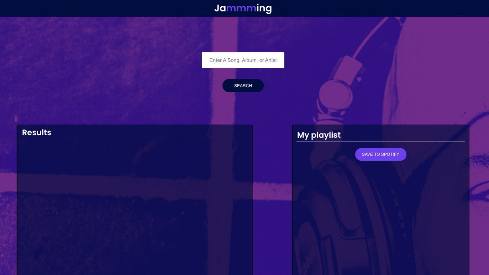

# Jammming

This was the final project from the 'Create a front-end app with React' on Codecademy.

## Table of contents

- [Overview](#overview)
  - [Screenshot](#screenshot)
  - [Links](#links)
- [My process](#my-process)
  - [Built with](#built-with)
  - [What I learned](#what-i-learned)

## Overview

The aim of the project was to build a React App where you can create custom playlists that combines multiple components, interactive search functionality, and requests to the Spotify API.

Users should be able to:

- Search for a song & see results relating to their seach query
- Add songs to their new custom playlist
- Save their new playlist to their spotify account
- N.B. Full functionality only works if I add the user to the app in the Spotify Developer dashboard

### Screenshot

### Links

- Solution URL: [https://ojknox.github.io/jammming/](https://ojknox.github.io/jammming/)

## My process

### Built with

- HTML
- CSS
- JS & React

### What I learned

- How to access the Spotify API
- Making a more complex React app with different components
